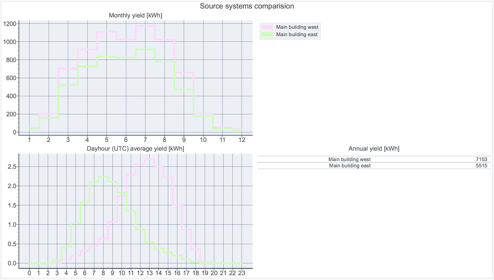
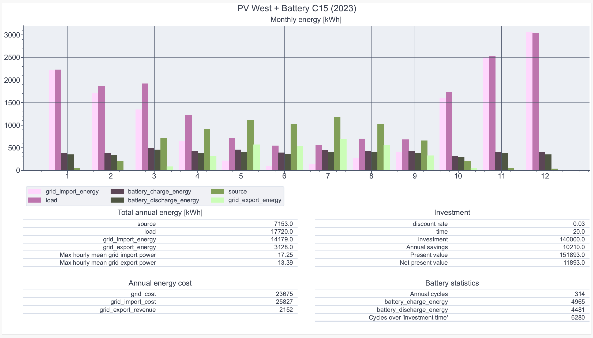
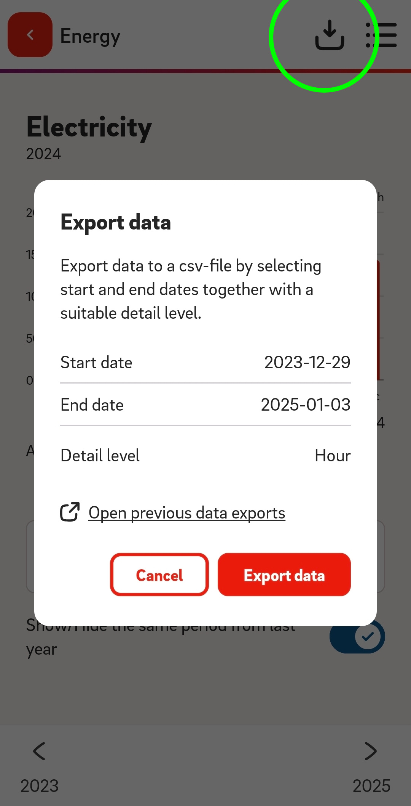
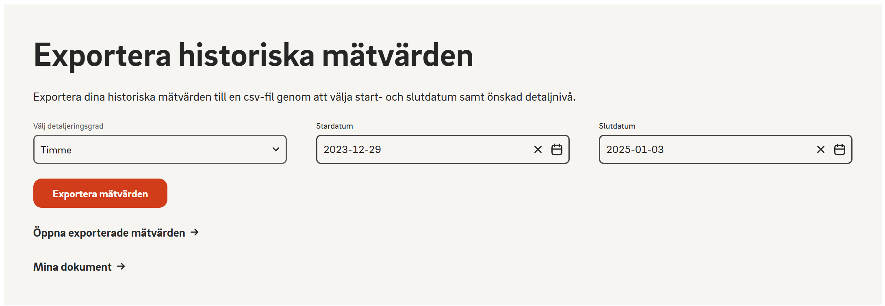

# Home ES sim

This CLI python tool generates a **PDF report** of a **simulated home energy system** with PV and battery storage.

This is a personal hobby project of mine. I built it for myself to make an educated decision weather to invest in PV+battery or not, and what the properties of that system should be. Please read the entire information so you know what it actually does before using it for anything real.

**No TRUTH is generated by this tool, only predictions based on the input. [Read the license](./LICENSE.md).**

&#x2615; [Buy me a coffee :)](https://paypal.me/davidalind)

<a name="inital_setup"></a>
## Inital setup

You need python installed. ([Python doc on Windows](https://docs.python.org/3/using/windows.html))

Clone repo or download and unzip https://github.com/kludda/home_es_sim
```
git clone https://github.com/kludda/home_es_sim.git
```
Enter `home_es_sim` folder.

Not neccesary but recommended; set up a [virtual environment for python](https://docs.python.org/3/library/venv.html) and activate (commands are for Windows, if you're un *nix you probably know already):

```
python -m venv .\.venv 
.\.venv\Scripts\activate
```

Install required modules:
```
python -m pip install -r requirements.txt
```

## Example usage

### PV simulation only

With a minimal [project definition file](#project_definition_file) one or many PV system setups on your house can be simulated. The report will contain a comparison between the PV systems.

project_pv_sample.yaml
```
location:
  name: Sample address
  latitude: 59.4
  longitude: 17.86
  altitude: 13
  timezone: Europe/Stockholm
  
source:
- name: Main building west
  pv simulate:
    inverter: "Fronius International GmbH: Fronius Symo 10.0-3 480 [480V]"
    arrays:
    - tilt: 45
      azimuth: 265
      module: JA Solar JAM72S30-555/MR
      mount: close_mount_glass_glass
      modules per string: 6
      strings: 2

- name: Main building east
  pv simulate:
    inverter: "Fronius International GmbH: Fronius Symo 10.0-3 480 [480V]"
    arrays:
    - tilt: 45
      azimuth: 85
      module: JA Solar JAM72S30-555/MR
      mount: close_mount_glass_glass
      modules per string: 6
      strings: 2

report:
```

Follow [inital setup](#inital_setup).

Edit `project_pv_sample.yaml` to your specification (or skip if you just want to test the tool).

Run simulation:

`python run.py --log info -d data -p project_pv_sample.yaml -o report_pv.pdf`

Results are in `report_pv.pdf` in the same folder.

Sample report page with source comparison:



### Home ES simulation

For a home ES simulation the tool need your:  
\- price of purchased energy, and the  
\- price of sold energy, and the  
\- consumption of your home.  
for each hour for a full year.

At this point the tool can help you get this data from Tibber.

Follow [inital setup](#inital_setup).

Edit `project_full_sample.yaml` [project definition file](#project_definition_file) to your specification (or skip if you just want to test the tool).

Get data from Tibber:
```
python -m home_es_sim.io.tibber --log info -d data -p project_full_sample.yaml tibbertoken=demo year=2023
```
Substitute `demo` with your API token from [developer.tibber.com](https://developer.tibber.com) or keep `demo` if you just want to test the tool.
`year` is the year for which you want to get data.

Run the simulation:
```
python run.py --log info  -d data -p project_full_sample.yaml -o report_full.pdf
```

Results are in `report_full.pdf` in the same folder.

Sample report page with configuration simulation results:



<a name="project_definition_file"></a>
## Project definition file

### General
Most `name` entries are used for filenames and must be unique.

The project definition file is in [YAML](https://yaml.org). Unless you only make minor changes, you should be familiar with [the basics (2.1)](https://yaml.org/spec/1.2.2/#chapter-2-language-overview), and `anchors` and `aliases` ([example 2.9 - 2.10](https://yaml.org/spec/1.2.2/#22-structures))

### Location
All tags are required. At this point this data is used for PV simulaton.

Example project definition entry:
```
location:
  name: Sample address
  latitude: 59.4
  longitude: 17.86
  altitude: 13
  timezone: Europe/Stockholm
```

**altitude**: [MASL](https://en.wikipedia.org/wiki/Height_above_mean_sea_level)

**timezone**: [TZ identifier](https://en.wikipedia.org/wiki/List_of_tz_database_time_zones)


### Grid 
**Grid** is your connection to the main grid. There can be only one grid.

**The simulation** need the price of purchased energy, and the price of sold energy, for each hour for a full year. 
Unfortunately historical spot prices are no longer free from [Nord pool](https://www.nordpoolgroup.com/).

<a name="grid_tibber"></a>
#### Tibber
At this point only Tibber is supported to get this data. You can get it using the following command
`python -m home_es_sim.io.tibber --log info -d data -p project.yaml tibbertoken=demo year=2024`

Substitute `demo` with your API token from [developer.tibber.com](https://developer.tibber.com).  
`year` is the year for which you want to get data.

Example project definition file entry:
```
grid: &grid
  name: Home grid
  capacity: 13.8 # kW. 230VAC * 20A * 3 / 1000
  import price: 
    tibber:
      transfer price fixed: 0.639 # transfer tarrif 0.2 + energy tax 0.439 = 0.639
      price vat: 1.25
  export price:
    tibber:
      transfer price fixed: 0.05 # grid benefit 0.05
      price vat: 1
```

**capacity**: the battery simulation will keep grid power under this value.

**transfer price fixed**: the tariffs added by the grid owner.

**price vat**: 1 + the VAT.


### Loads
**Load**: Something that "consumes" energy on your side of the grid connection.

There can be many loads. At this point only home consumption from Tibber and EON is developed. One can imagine other loads e.g. simulated EV charging.

**The simulation** need the consumption of your home, for each hour for a full year.

#### Tibber
Using the [command in *Grid* ](#grid_tibber) will get this data.

Example project definition file entry:
```
load:
- &home_consumption
  name: Home consumption
  tibber:
```

#### EON


 

You can download your data from EON in the app and on the [web](https://www.eon.se/mitt-e-on/din-forbrukning#/).

Use detail level `hourly`.

Get data for all the years you want to simulate. Set `start date` a day before new year and `end date` a day after new year (this is due to tool working in UTC and will not accept missing hours).

Rename the downloaded file to something descriptive and put it in your `data` folder. 

Example project definition file entry:
```
load:
- &home_consumption
  name: Home consumption
  eon:
    from csv: eon_load.csv
```


### Sources
**Source**: Something that "generates" energy on your side of the grid connection.

There can be many sources. At this point only PV simulation is developed. For existing PV systems production data is available in the Tibber API and could be developed. Importing from CSV could easily be added. One can imagine other loads e.g. actual or simulated hydro.

#### PV simulation

The simulation uses [PVLIB](https://pvlib-python.readthedocs.io/en/stable/). The generated energy will be based on a [Typical Meteorological Year (TMY)](https://joint-research-centre.ec.europa.eu/photovoltaic-geographical-information-system-pvgis/pvgis-tools/pvgis-typical-meteorological-year-tmy-generator_en) and will be the same regardless of which year you use for home consumption data. This obviously creates a mismatch between the actual weather causing the consumption and the simulated PV energy.

Example project definition file entry:
```
source:
- &pv_west
  name: Main building west
  pv simulate:
    inverter: "Fronius International GmbH: Fronius Symo 10.0-3 480 [480V]"
    arrays:
    - tilt: 45
      azimuth: 265
      module: JA Solar JAM72S30-555/MR
      mount: close_mount_glass_glass
      modules per string: 5
      strings: 2

- &pv_east
  name: Main building east
  pv simulate:
    inverter: "Fronius International GmbH: Fronius Symo 10.0-3 480 [480V]"
    arrays:
    - tilt: 45
      azimuth: 85
      module: JA Solar JAM72S30-555/MR
      mount: close_mount_glass_glass
      modules per string: 5
      strings: 2
```

**inverter**: The inverter used in the PV system. Enter the string in the `Name` column in CEC Inverters.csv at https://github.com/NREL/SAM/tree/develop/deploy/libraries

**tilt**: The angle of the PV modules. Horizontal = 0, Vertical = 90

**azimuth**: The heading of the PV module faces, projected on the horizontal plane. North = 0, South=180 East = 90, West = 270

**module**: The PV module used in the PV system. Enter the string in the `Name` column in CEC Modules.csv at https://github.com/NREL/SAM/tree/develop/deploy/libraries. The PV in the sample seem to be reasonable representative of a modern PV module you would get installed today, let me know if you find a better one!

**mount**: The way your PV modules are installed, and the material of the face and backing of the module. For a modern residential PV module on a roof use `close_mount_glass_glass`. Other options are:`open_rack_glass_polymer`, `open_rack_glass_glass`, `close_mount_glass_glass` or `insulated_back_glass_polymer`, see [PVLIB](https://pvlib-python.readthedocs.io/en/stable/reference/generated/pvlib.temperature.sapm_module.html#pvlib.temperature.sapm_module).


### Storage
**Storage**: Something that can store energy on your side of the grid connection.

You can define many storages. There can only be one storage per simulation. At this point only a simulated battery is developed.

#### Battery

Simulates battery usage using [PuLP](https://coin-or.github.io/pulp/) with minimum grid cost as target.

Since all data is known (which is obviously not the case in real life) it can solve an optimal battery usage from a grid cost perspective. The rationale is that the "AI" functions of a real battery will do quite well.

Example project definition file entry:
```
storage:
- &batt_c15r10
  name: Battery C15 R10
  battery:
    capacity: 15
    rate: 10
    charge efficiency: 0.95
    discharge efficiency: 0.95
    degradation cost: 0
```

**capacity**: In kWh. You can define max and min SOC for each simulation.

**rate**: Charge and discharge rate in kW.

**charge efficiency**: Factor of input energy vs. battery charge. Default 0.95. Can be omitted.

**discharge efficiency**: Factor of battery charge vs. output energy. Default 0.95. Can be omitted.

**degradation cost**: Currency unit/kWh cycled. E.g. (70000 SEK / 18 kWh) / 10000 cycles lifespan = 0.39. Default 0. Can be omitted. This parameter will (only) cause the optimizer to consider cycle cost and you can use it as a way to affect the total number of cycles of the battery over a period of time.


### Report

The report tag contains the different configuration you want to include in your report.

The report will also contain a comparison between different configurations and a comparison of sources (if defined).

The tool can calculate [the present and net present value](https://en.wikipedia.org/wiki/Net_present_value) of your investment in energy systems. The "cash flow" in the calculation is the difference in grid energy cost. First we can add a collection with arbitrary unique name where we can set some common values for all configurations so that we can easily change later:

```
common:
- &npvrate 0.03
- &npvtime 20
- &year 2023
```

A baseline needs to be defined so start the report with your current setup. Often this is just the grid connection and the home consumption. We use alias to get the information previously entered. We also define an anchor `&npvnorm` for this configuration.

The `compose` tag defines the data to collect to optionally send to a simulation.

`report` is a sequence.  
`grid` is one tag.  
`load` is a sequence.

```
report:
- &npvnorm
  name: Current setup
  year: *year
  compose:
    grid: *grid
    load: 
      - *home_consumption
```

Then we can start to add configurations we'd like to evaluate. 

Example PV only:
```
- name: PV West
  year: *year
  compose:
    grid: *grid
    load: 
      - *home_consumption
    source:
      - *pv_west
  npv:
    compare: *npvnorm
    discount rate: *npvrate
    time: *npvtime
    investment: 70000
```

**compare**: The configuration to compare grid energy cost with.

**discount rate**: Percentage as decimal: 3% = 0.03. In this case the interest rate you'd get if you invested the money elsewhere (savings account, stock market, ...)

**time**: Years. In this case maybe the expected lifetime of the energy system is a reasonable figure.

**investment**: The amount of money this configuration would cost you.


We can add as many configurations we want.

Example PV + battery, and PVx2 + battery:
```
- name: PV West + Battery C15
  year: *year
  compose:
    grid: *grid
    load: 
      - *home_consumption
    source:
      - *pv_west
  simulate:
    storage: *batt_c15r10
    soc min: 0.134
    soc max: 1
  npv:
    compare: *npvnorm
    discount rate: *npvrate
    time: *npvtime
    investment: 140000
    addsavings: 2775

- name: PV West + PV East + Battery C15
  year: *year
  compose:
    grid: *grid
    load: 
      - *home_consumption
    source:
      - *pv_west
      - *pv_east
  simulate:
    storage: *batt_c15r10
    soc min: 0.134
    soc max: 1
  npv:
    compare: *npvnorm
    discount rate: *npvrate
    time: *npvtime
    investment: 180000
```

The `simulate` tag defines a simulation. This is normally a storage.

`simulate` is one tag.  
`storage` is one tag.

Additional tags for npv:

**addsavings**: Additional annual savings from this configuration. Maybe you can go from 25 to 20A main fuse if you have a battery? Default 0. Can be omitted


Additional tags for the simulation:

**soc min**: factor of battery capacity for minimum charge. Sometimes you wish to ensure you always have a little left; maybe for backup island mode, or for unexpected loads during peak (maybe test what `soc min: 0` vs.  `soc min: 0.134` does for the annual savings vs. what you expect the outliers would cost). Default 0. Can be omitted

**soc max**: factor of battery capacity for maximum charge. Maybe your battery chemistry don't like to be charged to 100%? Default 1. Can be omitted.


# A note on the code
I'm a mechanical design engineer, not a software engineer. I got a POC running quite quick but refactoring modules etc. proved to be very time consuming for me and towards the end, especially with the code for the report generation, I simply had to "get it done".

I've learned **a lot** and it was fun. I probably won’t do much more development unless I need some new functionality my self.


# Acknowledgment
I could not have done this without (additional to the python standard library):

\- [PuLP](https://coin-or.github.io/pulp/)  
\- [PVLIB](https://pvlib-python.readthedocs.io/)  
\- [Matplotlib](https://matplotlib.org/)  
\- [Pandas](https://pandas.pydata.org/)  
\- [Blume](https://blume.readthedocs.io/)  
\- [PyYAML](https://pyyaml.org/)  
\- [GQL](https://gql.readthedocs.io/)  
\- [aquarel](https://aquarel.readthedocs.io/)  
